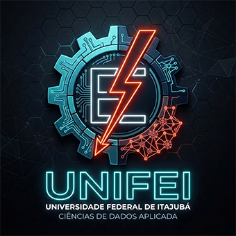

  
  <h1><b>Project M²QA: Metallic Mean Quantum Ansatz</b></h1>
  <h3>Topologia Borromeana Parametrizada por Constantes Irracionais</h3>

---

> **Aplicação Alvo:** Simulação Molecular de Repelentes para o Projeto **AedesTwin In-Silico**.

## 🧬 A Tese: Topologia vs. Parametrização

Este projeto investiga a sinergia entre **Topologia Quântica** e **Teoria dos Números** para resolver o problema da convergência em VQEs (Variational Quantum Eigensolvers).

Nós propomos um Ansatz híbrido que une:
1.  **Estrutura Topológica (Anéis de Borromeo):** Um emaranhamento três-partido onde a remoção de um qubit colapsa o estado, garantindo alta correlação quântica e proteção contra ruídos localizados.
2.  **Parametrização Dinâmica (Médias Metálicas):** Os ângulos de rotação das portas quânticas são impostos por razões matemáticas ($\phi$, $\delta_S$, $\rho$), evitando mínimos locais acidentais.

---

## 📐 O Protocolo Experimental (M²QA Table)

Testamos diferentes "frequências" de parametrização aplicadas à estrutura fixa Borromeana.

| Constante (Parâmetro) | Nome | Comportamento no Ansatz Borromeano | Recomendação de Uso |
| :--- | :--- | :--- | :--- |
| **$\phi$ (Phi)** | Razão Áurea | **Estabilidade Estrutural.** O anel "segura" a energia com máxima fidelidade. | Estados que exigem proteção total (QKD). |
| **$\delta_S$ (Delta)** | **Razão Prateada** | **Convergência Ótima.** A geometria do anel se abre para a solução rapidamente. | **Simulação Molecular (AedesTwin).** |
| **$\rho$ (Rho)** | Número Plástico | **Expansão Controlada.** Permite adicionar mais anéis (escala) sem perder coerência. | Circuitos profundos / Machine Learning. |
| **$e$** | Euler | **Dissipação Rápida.** Útil para simular sistemas onde a energia vaza naturalmente. | Física Estatística (Open Systems). |
| **$\mathcal{L}$** | Liouville | **Instabilidade Caótica.** A estrutura Borromeana não suporta essa frequência e colapsa. | Teste de estresse / Limite teórico. |

---

## 🔬 Metodologia

O circuito é gerado dinamicamente:

1.  **Camada de Emaranhamento (Hardware):**
    Conexão tipo Anéis de Borromeo entre qubits ($q_0, q_1, q_2$). Isso cria um estado GHZ (Greenberger-Horne-Zeilinger), a base para correlações fortes.
    
2.  **Camada de Rotação (Software):**
    Portas $R_y(\theta)$ onde $\theta$ é definido pela Tabela acima.
    *   *Teste:* $\theta = \pi \times \delta_S$ (Prata).
    
3.  **Aplicação (AedesTwin Integration):**
    Calculamos a energia de ligação de moléculas repelentes. A estrutura Borromeana garante que o erro de medição de um qubit não destrua a simulação toda, enquanto a Razão Prateada garante que o resultado saia rápido.

---

## 🚀 Próximos Passos

- [ ] Implementar o gerador de circuitos `BorromeanAnsatz` em Qiskit.
- [ ] Rodar o benchmark M²QA (Áurea vs Prata) em simuladores.
- [ ] Validar a hipótese de que Razão Prateada + Topologia Borromeana = Menos Barren Plateaus.
- [ ] Gerar dados de energia para o projeto **AedesTwin**.
