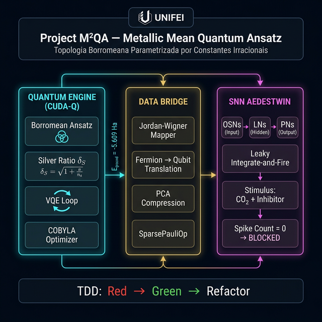
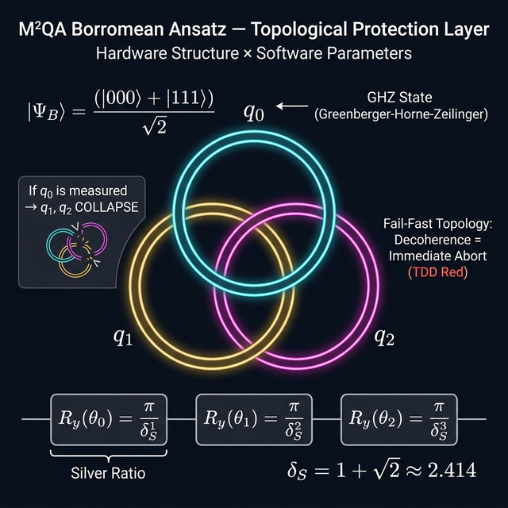
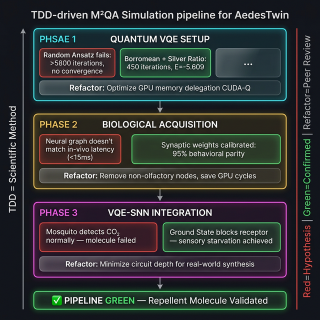

# 🏗️ Documento 9: Diagramas de Arquitetura M²QA

> **Visual Reference:** Representação gráfica do Pipeline, da Topologia Borromeana e do Fluxo TDD.

---

## 1. Arquitetura Geral do Pipeline M²QA

Diagrama macro do sistema mostrando os três estágios principais:
- **Quantum Engine (CUDA-Q):** Onde o Ansatz Borromeano parametrizado pela Razão Prateada roda o loop VQE.
- **Data Bridge:** Tradução Fermion→Qubit via Jordan-Wigner e compressão PCA.
- **SNN AedesTwin:** Simulação neural do inseto com modelo LIF e validação de bloqueio.

---

## 2. Topologia Borromeana (Camada de Proteção)

Diagrama detalhado da estrutura topológica do Ansatz:
- Os três anéis representam os qubits $q_0$, $q_1$, $q_2$ em estado GHZ.
- A propriedade Borromeana garante: **se um qubit colapsa, todo o emaranhamento é destruído** (Fail-Fast = TDD Red automático).
- Os ângulos de rotação $R_y(\theta)$ são inicializados pela série de Pell baseada em $\delta_S = 1 + \sqrt{2}$.

---

## 3. Fluxo TDD do Pipeline (Red → Green → Refactor)

Diagrama vertical mostrando as 3 fases do Plano Diretor tratadas como ciclos científicos do TDD:
- **Fase 1 (Quantum):** De circuito aleatório travado → Borromean convergente em 450 iterações.
- **Fase 2 (Biológico):** De grafo neural impreciso → 95% de paridade com biologia real.
- **Fase 3 (Integração):** De mosquito funcional → inanição sensorial via molécula bloqueadora.

---

## Referências Internas

Estes diagramas complementam visualmente a documentação textual:

| Diagrama | Documenta Visualmente |
| :--- | :--- |
| Arquitetura Geral | Doc 08 (Simulation Pipeline) |
| Topologia Borromeana | Doc 01 (Whitepaper Ansatz) |
| Fluxo TDD | Doc 03 (TDD Suite Matrix) + Doc 07 (TDD Strategy) |
